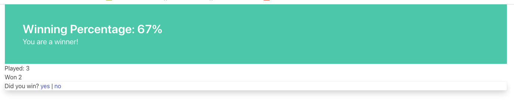
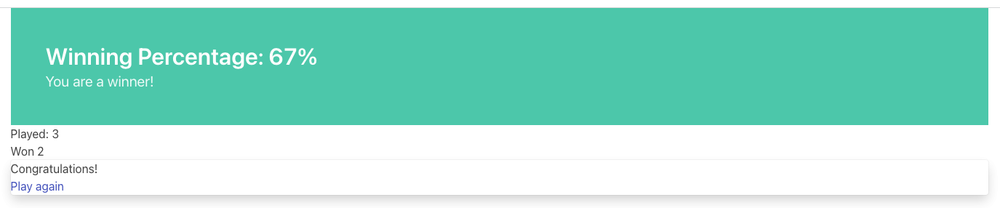

= Rez: a tool for creating HTML-based interactive fiction games
:toc:

== Introduction

Rez is a language for writing interactive fiction/RPG/simulation games using HTML and incorportating Javascript, CSS, and optionally graphics, audio, and movie files.

Rez started as a **quick** alternative to https://twinery.org/[Twine] for an author who had become frustrated with Twine.

Twine describes itself as an "open source tool for telling interactive, nonlinear stories." It makes it relatively easy for those with almost no development experience to get started and create a choice-based game.

Rez, by contrast, is designed for making games whose complexity is not well suited to Twine and where a move to a parser based alternative such as https://ganelson.github.io/inform-website/[Inform] or https://www.tads.org/[TADS] is not desirable.

Rez's complexity sits somewhere between advanced Twine and Inform/TADS. It has a relatively simple, declarative, syntax but requires the author to be comfortable writing small Javascript functions to implement complex behaviours.

Rez has a standard library including support for creating NPCs, item & inventory management, scenes, and maps and a behaviour tree system to introduce AI behaivour. Rez also features a simple, yet powerful, layout & templating system.

Rez is designed to be flexible enough to create a really complex and ambitious game while offering a simple & usable framework for those just getting started.

=== Outline of a Rez Game

A Rez game is written in the form of one or more `.rez` source files that get compiled into an HTML index page & a Javascript application, plus any associated assets like images, movies, and sounds.

A Rez source file contains elements and directives that describe the various components of a game and how it connects together.

At the top level is the `@game` element that contains the game metadata and all
the other elements that make up the game.

=== Creating a new game

The command:
....
rez new --author-name="Name" --author-email="email" --game-title="Title" --game-homepage="URL" <name>
....

For example specifying `<name>` as "mygame" will create a `mygame` folder containing a number of subfolders. In the `src` subfolder will be `mygame.rez` that will contain some example source.

=== Compiling your game

The command:
....
rez compile src/<game_name>.rez
....

Compiles the sources into a game in the `dist` sub-folder. It creates an `index.html` as well as copying all of the Javascript & other asset files that constitute the game.

=== Distributing your game

To distribute your game you distribute the contents of the `dist` folder. For example by compressing it into a `.zip` file or wrapping it in an https://www.electronjs.org/[Electron] app.

=== Frameworks

Rez includes two default frameworks:

* https://bulma.io/[Bulma CSS] for stylesheet support
* https://alpinejs.dev/[Apline.js] for dynamic UI support

The files for these will automatically be copied into your `dist` folder when you compile the game.

=== Source code format

Rez games are written in plain UTF-8 files with a `.rez` extension.

The `%` character is special in Rez and indicates a macro of which the most common is `%%` for comments.

=== Comment macro

Rez comments begin with `%%` and continue to the end of the line.

....
%% this line will be ignored
....

=== Include macro

Once source file may include another by using the include macro `%(…)`, for
example:

....
%(act_one.rez)
....

An included file may include other files but beware of creating a cyclic dependency. For example this code will hang the compiler:

....
file1.rez
---------
%(file2.rez)

file2.rez
---------
%(file1.rez)
....

== The Rez Language

Rez is a declarative language for writing a game in terms of a set of elements representating the game contents.

In Rez elements are things like items, actors, scenes, locations, assets and so forth. During compilation Rez draws these elements together and converts them into Javascript objects that represent the game when running in the browser.

Elements are generally described using a set of named attributes. For example an `item`` might have a `description` attribute that can be displayed to the player when they examine the item.

Rez uses Javascript functions to supply dynamic behaviour. For the most part you can ignore this but, as your game becomes more complex and you want to incorporate dynamic behaviours, you may need to familiarize yourself with writing small Javascript functions.

Here is an example of a Rez element that includes a dynamic attribute:
....
@item magic_ring begin
  is_a: :ring
  magic: true
  material: gold
  owners: 5
  belongs_to: #sauron
  inscription: "Please return to Mordor",
  on_wear: (actor) => {
    if(actor.id == "sauron") {
      actor.game.sauron_victory = true;
    } else {
      actor.makeInvisible();
    }
   }
end
....

There's a lot going on here but we'll unpack it piece by piece.

=== Introduction to Elements

In the first place is the element itself:
....
@item magic_ring begin
  ....attributes....
end
....

With the exception of xref:element_catalog#Relationship[@rel], element declarations follow a common pattern:

* element specifier with `@` prefix, e.g. `@item`
* a unique ID of the element, e.g. `magic_ring`
* `begin` statement
* attributes
* `end` statement

Elements are used to describe in-game concepts. The xref:element_catalog.adoc[Element Catalog] describes each element in detail.

The `id` of an element must be unique and follow the rules for Javascript identifiers. In JavaScript, identifiers are case-sensitive and can contain Unicode letters, `$`, `_`, and digits (`0`-`9`), but may not start with a digit.

=== Introduction to Attributes

The element declares itself to be an item but what about the attributes? These describe the item (or any element) and how it behaves. In our example there are 7 attributes that demonstrate many of the built-in types:

....
is_a: :ring
magic: true
material: gold
owners: 5
belongs_to: #sauron
inscription: "Please return to Mordor",
wear: (actor) => {
  if(actor.id == "sauron") {
    actor.game.sauron_victory = true;
  } else {
    actor.makeInvisible();
  }
}
....

There are seven attributes defined here:

[cols="1,2"]
|===
|`is_a`
|a keyword, a symbol often used when there are a few legal values

|`magic`
|a boolean

|`material`
|another keyword

|`owners`
|a number

|`belongs_to`
|a reference to another element

|`inscription`
|a string

|`wear`
|an event script in Javascript arrow function format
|===

The pattern for any attribute is `<name>: <value>`. The space after the colon is required and note that there is no `,` or `;` at the end as you may be familiar with from other programming languages.

**Legal**

    title: "The Maltese Parrot"

**Not-legal**

    title : "The Maltese Parrot"
    title :"The Maltese Parrot"
    title:"The Maltese Parrot"

Attribute names follow the rule for Javascript identifiers:

* cannot contain spaces
* are case sensitive
* must begin with a letter, underscore `_`, or dollar `$`
* can only contain letters, numbers, underscores, or dollar signs

Note that attribute names with a leading underscore (`_`) are considered to be 'internal' to the Rez compiler. These attributes are not converted into runtime attributes and are, therefore, not available.

Attribute names with a leading dollar (`$`) are considered to be 'special' and it is not advised to use them yourself unless you know what you are doing.

Rez defines a number of attribute types, some simple and some more complicated requiring some Javascript knowledge:

[cols="1,2,2"]
|===
|Boolean
|a truth value that you can test to create conditional behaviour
|`true`\|`false` (not that `yes` and `no` can also be used interchangably)

|Number
|a numeric value that can be positive, negative, integer, or decimal. Rez doesn't have separate types for these.
|`5`\|`-1`\|`0.5`

|String
|a text value suitable for shorter strings. For longer passages a Heredoc may be easier
|`"it's a plaster bust of a parrot"`

|Keyword
|a symbol, usually used for constant values. Note that keywords can be turned into hierarchies by the xref:element_catalog#Derive(Directive)[`@derive`]
|`:single`\|`:multiple`, `:red`\|`:green`\|`:blue`

|Element Reference
|an identifier referring to the unique id of an element
|`#sauron`, `#gandalf`, `#the_ring`

|Heredoc String
|a text value that can span across multiple lines
|`"""it's a plaster bust of a parrot"""`

|Template
|a text value that can span multiple lines and content template expressions that are dynamically interpolated at runtime
|`+```The ${animal.adjective} ${animal.color} ${animal.species} jumped over the ${other_animal.adjective} ${other_animal.species}```+`

|List
|a sequence of other values, that can be of any Rez attribute type, inside `[]`. Note that Rez lists do not use a `,` to separate values.
|`+[1 2 3]+`, `+["red", "green", "blue"]+`

|Set
|an unordered collection of unique values of any Rez attribute type. Note that rez Sets do not use a `,` to separate values.
|`+#{:red :green :blue}+`

|Table
|a collection of name: value pairs where the values can be of any Rez attribute type. Note that Rez tables do not use a `,` to separate name: value pairs.
|`+{color: :red size: :large print: "Danger"}+`

|Tracery Grammar
|a text value whose contents should be a https://github.com/galaxykate/tracery[Tracery] grammar
|`+G``{origin: ...}```+`

|Script (Event)
|a Javascript function for handling an event. Expected to be in arrow format and passed the object receiving the event and the event as parameters.
|`(game, event) => {...}`

|Script (Action)
|a Javascript function expected to be called, e.g. in an event handler. Expected to be in traditional function style and where `this` is the object in question.
|`function() {...}`

|Dice
|a dice roll, in https://en.wikipedia.org/wiki/Dice_notation[Dice Notation] that is re-evaluated each time it is referenced
|`2d6+1`, `d4`, `3d6-1`, `2d10`

|File
|a string value that is imported from a file
|`+<<<FILE_NAME>>>+`

|Attribute Alias
|References an attribute in another element
|`&sauron.location`

|Probability Table
|A list of pairs wrapped in `\|` that becomes a generator property.
|\|"key_1" freq_1 "key_2" freq_2 "key_3" freq_3\|

|Dynamic Initializer
|A Javascript expression that is evaluated when the game starts
|`^i{Math.rand_int(1,10)}`

|Dynamic Value
|A Javascript expression that is evaluated each time the attribute is referenced
|`^v{this.uses * this.item_value * 25}`

|Dynamic Property
|A Javascript function expression that is converted into an object property
|`^p{return this.first_name + " " + this.last_name}`
|===

These last four dynamic attribute types are worth a special mention.

=== Probability Table

Esp. useful for procedural generation a probability table is a list of pairs where the first element is the key and the second is the frequency. Let's take eye color for example, we want characters we generate to have different coloured eyes. In reality brown eyes are most common at about 48% of the population, then blue at 29, green at 14%, and grey at about 9%. How could we generate a realistic distribution of eye colour (very important in games):

....
eye_color: |:brown 48 :blue 29 :green 14 :grey 9|
....

A different example might be a loot table, how could we generate one of those:

....
loot_quality: |:poor 20 :okay 10 :great 5 :amazing 1|
....

Our frequencies don't have to % based and add up to 100, in this example we've given relative frequencies.

We can also use `#id`'s as the key:

....
meet_on_the_road: |#ranger 15 #wizard 10 #traveller 45 #evil 30|
....

At the moment, due to a lack of JSON support, it is not possible to use functions as keys. However you can use objects with an identically named function:

....
@object f1 begin f: function() {...} end
@object f2 begin f: function() {...} end
@object f3 begin f: function() {...} end

@object f begin
f: |#f1 50 #f2 25 #f3 25|
end

$("f").f.f()
....

It's not elegant but it's feasible. This will likely get cleaned up in a future version.

=== Dynamic Initializer

A dynamic initializer uses the form `^i{...}` to run an expression once at the time the object is created. This is useful for setting a generated value (e.g. a random value) after which the attribute behaves normally using getters/setters.

=== Dynamic Value

A dynamic value uses the form `^v{...}` to create an expression that gets evaluated each time it is referenced. This should be mostly superceded by the use of `^p{...}` to create properties.

We use the caret symbol `^` to create different kinds of dynamic attribute value. There are three kinds:

* dynamic initializers
* dynamic values
* properties

== What's in a Game?

The simplest possible Rez game would look something like this:

....
@game begin
  name: "Test Game"
  IFID: "D3C31250-53B4-11ED-9A26-3AF9D3B0DD88"
  archive_format: 1
  initial_scene: #play_game
  layout_mode: :single
  layout: ```
  ${content}
  ```

  %(stdlib.rez)

  @scene play_game begin
    initial_card: #did_you_win
    layout_mode: :single
    played: 0
    won: 0
    win_p: 0
    layout: ```
    <div class="container">
      $if{scene.played > 0} {%
        <section class="hero is-primary">
          <div class="hero-body">
            <p class="title">Winning Percentage: ${scene.win_p | round: 0}%</p>
            <p class="subtitle">
              $if{scene.win_p >= 50.0} , 
            </p>
          </div>
        </section>
      %}

      <p>Played: ${scene.played}</p>
      <p>Won ${scene.won}</p>

      ${content}
    </div>
    ```
    win: function() {
      this.played += 1;
      this.won += 1;
      this.win_p = this.won * 100 / this.played;
    }
    lose: function() {
      this.played += 1;
      this.win_p = this.won * 100 / this.played;
    }
  end

  @card did_you_win begin
    content: ```
    Did you win? [[yes|yes_i_won]] | [[no|no_i_lost]]
    ```
  end

  @card yes_i_won begin
    content: ```
    Congratulations!

    [[Play again|did_you_win]]
    ```
    on_start: (card) => {
      card.scene.win();
    }
  end

  @card no_i_lost begin
    content: ```
    Better luck next time!

    [[Play again|did_you_win]]
    ```
    on_start: (card) => {
      card.scene.lose();
    }
  end
end
....




This is a terrible game but it illuminates some of the basic principles of how you create a game using Rez.

It uses 3 types of element: xref:element_catalog#Game[`@game`], xref:element_catalog#Scene[`@scene`], and xref:element_catalog#Card[`@card`]. The scene has some attributes to keep track of the game state and two actions, the cards use an event handler and some template links.

The `@game` is a required top-level element that contains the definintion of the game and holds the master layout into which scene content is inserted, and the reference to the scene that starts the game.

A game must have at least one `@scene`. A scene represents a context where specific events or interactions take place. It must also have an `initial_card` attribute that defines which card is played into the scene when it starts. You can run your game from a single scene or use multiple scenes where it makes sense to do so.

Lastly the cards, which are "played" into the scene, and which provide the bulk of the content presented to the player.

So we have a structure:

....
@game/layout
  @scene/layout
    @card/content
....

The card content is rendered into the scene layout, and the scene layout is rendered into the game layout. You might notice the scene has a `layout_mode` attribute. In this case we are using the `single` layout mode that presents only the current card. There is also a `stack` layout mode that presents all of the cards played into the scene.

The scene in this case defines two script attributes `win` and `lose` that update the score and winning percentage. These are called from the `on_start` event handler of the cards `yes_i_won` and `no_i_lost`. The event handlers are Javascript arrow functions that take their source object (and, optionally, an event object) as a parameter. The scene scripts are regular functions where `this` is the object in question (in this case the scene `play_game`).

You can use Markup for simple formatting although here we are showing off some of the Bulma CSS classes. We also using template expressions to display variables `${}` and conditionally present content `$if{} `.

You can go quite a long way using only this subset of Rez's features.

== What's Going on in the Browser

We should distinguish between two environments: The _author_time_ environment where we're dealing with `.rez` source files containg elements & attributes, and the _runtime_ environment where these have been compiled into JavaScript code that runs in the browser.

In the runtime environment `@game` has been translated into a JS object with `RezGame` as its prototype, the scene into a JS object with `RezScene` as its prototype, and the cards into JS objects having `RezCard` as their prototype. For most elements there is a 1:1 correspondence between it and an equivalent JS object.

[Advanced Note]: If you want to use different objects you can use the `$js_ctor` attribute to define which constructor function gets called. When replacing built in objects its advisable to have the built-in object as a prototype of your custom object.

The Game starts with a called to the game object `start` method which handles initialization and presenting the first scene & card.

== The Rez Rendering Process

When the game layout gets rendered its content is embedded inside a built-in template:

....
<div class="game">
    ...game layout...
</div>
....

You can target the whole game content using the `game` CSS class.

The game `layout` is a good place to put fixed parts of the interface, for example titles, score, current time or location, and so on. The game layout is expected to contain the template expression `${content}` which will include the contents of the current scene.

When the current scene gets rendered its content is embedded into a different template:

....
<div id="scene_<scene-id>" class="scene">
  ...scene layout...
</div>
....

In the same was as the game, the scene `layout` is expected to contain the template expression `${content}` which will include the contents of the current card or cards. You can style scenes by targetting the `scene` CSS class or customise styles for particular scenes by targetting the DOM id. In our example game that would be `scene_play_the_game`.

When a card gets rendered its content is embedded into yet another template:

....
<div id="card_<render-id>" data-card="<card-id>" class="card <card-type>">
   ...card content...
</div>
....

Here are introduce two new concepts the `render-id` and `card-type`. The `render-id` becomes important when using `layout_mode: :stack` for a scene. In this context the same card may be rendered multiple times. Each card gets its own render ID and preserves uniqueness of DOM ids.

The `card-type` will be one of `card_active`, `card_passive`, or `block`. We'll come back to active & passive blocks later when we talk about the stack layout.

Block content comes from cards that are being rendered inside another card. For example you might have a card `#sidebar` that we want to use to render sidebar content that should always be visible.

In this case we would add it to (for example) the scenes `blocks:` attribute. To include it within the scene layout you would use the template expression `${sidebar}`.

== Scene Layout Mode

A `@scene`` has a required attribute `layout_mode:` which can, as of v0.11, have two values:

* `:single`
* `:stack`

In `:single` mode the `${content}` substituion embeds the content of the current card in the scene. When the card changes the content will change to match it. The effect is that the scene will jump from card to card.

In `:stack` mode the `${content}` substitution embeds the content of every card that has been played into the scene so far. Rather than jumping from card to card the cards will accumulate.

However, as a new card is played the previous card gets "flipped". What that means is that instead of rendering the `content` attribute it renders the `flipped_content` attribute.

For example a card might present the player with two options. If the card didn't get flipped it would continue to present two options even though an option had been selected. But the flipped version can, instead, display the chosen option.

== Linking to the next card or scene

Borrowing from Twine there is an easy way to specify a link to play a new card or change to a new scene. The simplest form is:

....
[[Link Title|card_id]]
....

e.g.

....
[[Play Again|play_the_game]]
....

This will be converted into a link that plays the card with id `play_the_game` and is titled "Play Again". If you don't specify a card id it will convert the title and look for that. So:

....
[[Play Again]]
....

is equivalent to:

....
[[Play Again|play_again]]
....

There may be situations where you only want links to appear under specific circumstances. You could do this a template expression but Rez has a built-in facility for dynamic links. Using the syntax:

A link to switch to a new scene uses the syntax:

....
[[Link Title|>scene_id]]
....

This presents a link which, when clicked, while load the new scene with id `scene_id` and automatically play its initial card.

....
[[Link Title|!scene_id]]
....

This presents a link which, when clicked, acts like the previous type of link except that it interrupts, rather than ending, the current scene so that the current scene can be resumed. An example of where this kind of link is useful is for presenting a player inventory. Looking at the inventory steps out of normal gameplay. When the player is done with the inventory they expect to be back where they were before they triggered it.

....
[[Link Title|!!]]
....

Presents a link that, when clicked, ends an interlude scene and resumes the previous scene from where it left off. Interludes are held in a stack so it's possible to interlude from an interlude and then rewind back to the starting point.

== Event Links

An event link is written:

....
[[Link Title|*event_name]]
....

This will be rendered as a link that looks for an `on_<event_name>` event handler attribute on the current card.

Once the event handler has done its work it should return a response object.

=== Event Reponse Objects

Return an object from an event handler to determine what happens next. Some object types can be combined (e.g. the `flash` message combines with most of the other choices)

....
{scene: "scene_id"}
....

To start a new scene.

....
{card: "card_id"}
....

To play a new card into the current scene.

....
{flash: "message"}
....

To set a flash message.

....
{render: true}
....

To have the current view re-rendered.

....
{error: "message"}
....

To log an error message to the console.

== Dynamic Links

....
[[*play_again]]
....

Causes Rez to look for a script attribute `play_again` in the current card or scene and pass it a xref:jsapi#RezDynamicLink[RezDynamicLink] object that it can use to customise link presentation.

....
play_again: function(link) {
  if(this.play_count > 9) {
    link.deny("You have played too many times already!");
  } else {
    link.allow("Play Again", "play_again");
  }
}
....

Once the player plays their 10th game this link becomes inactive. Alternatively you can use `link.hide()` and the link won't appear at all. Good for options which should be concealed until some gameplay condition is met.

== Assets

Assets are files that you want to include in your game for example images, audio files or movies. Rez handles copying these into your game distribution folder and generating appropriate references.

You declare an asset with an `@asset` element:

....
@asset pistol_image begin
  file: "pistol_image_01.png"
  width: 60
  height: 60
end
....

Rez handles finding the asset file and making it available in the dist folder. Now if you want to include it you have two options, both using template expressions.

....
${"pistol_image" | asset_tag}
....

Because the asset is an image this will generate an `` tag that points to the image file relative to the game file.

As of v0.11 only image files are supported but sound & movie support will be included soon.

The second approach is to generate a path and build your own tag:

....

....

This will work for audio & movie assets.

== Template Expressions

Template expressions are how you include dynamic content in your game user interface.

[Advanced Note: Prior to v0.10 Rez used the Handlebars.js templating system and the handlerbars compiler and had the `@helper` directive to create new helpers. This has been completely replaced by the Rez template expression system which has a built-in compiler and offers `@filter`s as an alternative to helpers.]

Template Expressions are loosely based on the https://shopify.github.io/liquid/[Liquid] template system. But it's worth noting that they are not Liquid and you should always refer to this documentation not the Liquid docs.

There are three kinds of template expression.

=== Subsitution Expressions

A substitution is where we replace a token like `${player.name}` in a template with the value of the expression. For example:

....
content: ```Your name is ${player.name}. It is a good name.```
....

If the `player`` objects `name` attribute is "matt" this will return:

....
Your name is matt. It is a good name.
....

Note that the an expression is only a lookup. You cannot use arbitrary JS expressions, so:

....
content: ```Your name is ${player.name + "!"}```
....

Will not work. If you want to modify the value you must use a filter expression (see below) to do so.

Where does this `player` reference come from? Good question, this is an example of a binding. You've already seen bindings at work with `${content}` and `${sidebar}`. `content` is an example of a binding that Rez automatically makes available but you can add your own to refer to any objects you like.

....
bindings: {player: #player}
content: ```Your name is ${player.name}```
....

Here we are binding the Javascript variable `player` to an element with id `#player` which we assume would be an `@actor` element for representing the player character. We can also make function bindings:

....
bindings: {player: () => {return $("player")}}
....

Would be an equivalent way of creating this binding. Because we often want to refer to game elements we have the shorthand above. If we didn't know the object we wanted to bind to in advance we can use a dynamic binding with a function.

==== Substitution Filters

If all we could do was return the attribute values of functions then expressions wouldn't be very useful. Filters, inspired by Liquid, let us manipulate values into the content we want to display.

For example, let's say we wanted to capitalize the players name:

....
content: ```Your name is ${player.name | capitalize}. It is a good name.```
....

Would render as:

....
Your name is Matt. It is a good name.
....

When using a filter you put a pipe symbol `|` followed by the filter expression which is sometimes just the name of the filter (See the xref:filter_catalog[Filter Catalog] for a complete list of built-in filters) but can also include parameters.

....
content: ```The item has the inscription "${item.inscription | trunc: 40}"```
....

This is an example of a filter that takes parameters. They are separated from the filter name by a colon `:` and if there is more than one parameter separate them with a comma.

You can also have multiple filters, separating each with a `|`. For example:

....
content: ```The book belongs to ${actor.name | prepend: actor.title}.```
....

might render as:

....
The book belongs to Mr Sam Spade.
....

=== Conditional Templates

The second type of template expression is the conditional template. This allows content to be dynamically included based on an expression. The format of a conditional template is:

....
$if(expression) 
....

or

....
$if(expression) , 
....

In the game example above we used:

....
$if(scene.played > 0) 
....

To determine whether to show the won/lost percentage template content. Nested template can also contain template expressions and their own conditional templates.

=== Iteration Templates

The third type of template expression is an iterator template. This allows content to be created from a list of values (In Javascript terms, anything that could be an array). The format of an iterator template is:

....
$foreach(x: list) 
....

This will iterate over the binding `list` and run the template expression once for each element of `list` binding `x` to that element.

....
$foreach(x: list) , 
....

This alternate form accepts an optional second template expression. This expression will be rendered between each rendering of the content expression.

Note that the list binding should either be an object in the `bindings` or a property of an object in `bindings`. You cannot use arbitrary expressions. If you need to use an arbitrary expression use a function binding, so instead of:

....
content: ```
$foreach(x: a.b.map((el) => somefun(el))) 
````
....

you would write:

....
bindings: {list: function() {return a.b.map((el) => somefun(el))}}
content: ```
$foreach(x: list) 
```
....

== Custom Scripts & Styles

Rez supports the addition of custom Javascript & CSS in a number of different ways.

=== Script & Style Directives

The `@script` and `@style` directives allow embedding arbitrary Javascript or CSS classes into your game.

....
@script begin
  function identifyParrot(p) {
    if(p === "parrot") {
      return "Sqwauk";
    } else {
      return "Pfffft";
    }
  }
end
....

....
@style begin
  /* https://gist.github.com/JoeyBurzynski/617fb6201335779f8424ad9528b72c41 */
  .main {
    max-width: 38rem;
    padding: 2rem;
    margin: auto;
  }
end
....

The contents of these directives is automatically inserted into an appropriate spot in the game files.

=== Patching Javascript

Another way to include your own Javascript is through the use of the `@patch` directive which allows you to add new methods to existing JS classes. Here is an example from the stdlib.

....
@patch ARRAY_FY_SHUFFLE begin
  %% Fisher-Yates Shuffle impl from: https://sebhastian.com/fisher-yates-shuffle-javascript/
  patch: "Array"
  method: "fy_shuffle"
  impl: function() {
    let idx = this.length;
    while(--idx > 0) {
      const rand_idx = Math.floor(Math.random() * (idx+1));
      [this[rand_idx], this[idx]] = [this[idx], this[rand_idx]];
    }
    return this;
  }
end
....

This adds a new method `fy_shuffle` to Javascript `Array` instances. So you can now write:

....
[1, 2, 3, 4, 5, 6, 7, 8, 9, 10].fy_shuffle()
=> [3, 7, 6, 8, 4, 9, 1, 2, 5, 10]
....

To add a method to instances use the `method:` attribute and specify the method name. To add a function to a constructor use the `function:` attribute instead.

=== Write Your Own Filters

A third way to include custom Javascript is by implementing a template expression filter. Here is an example from the stdlib:

....
@filter STRING_STARTS_WITH_FILTER begin
  %% String -> Bool

  name: "starts_with"
  impl: (s, search) => {return s.startsWith(search);}
end
....
